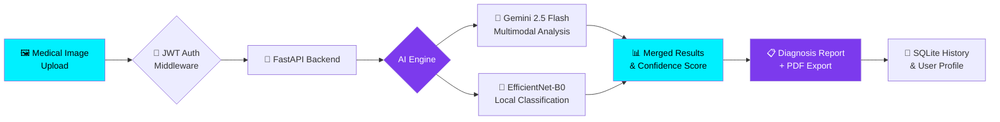

<div align="center">

<!-- Animated Banner -->


<!-- Typing animation -->
<a href="#">
  
</a>

<br/>

<!-- Status Badges -->
[](https://python.org)
[](https://fastapi.tiangolo.com)
[](https://pytorch.org)
[](https://deepmind.google/technologies/gemini/)
[](LICENSE)

<br/>

<!-- Live Stats -->


</div>

---

<div align="center">
  <h2>🌐 LIVE DEMO PREVIEW</h2>
</div>

<div align="center">

```
┌─────────────────────────────────────────────────────────────────────┐
│  ██████╗  ██████╗  ██████╗██╗  ██╗███████╗████████╗███████╗ ██████╗│
│  ██╔══██╗██╔═══██╗██╔════╝██║ ██╔╝██╔════╝╚══██╔══╝██╔════╝██╔════╝│
│  ██████╔╝██║   ██║██║     █████╔╝ █████╗     ██║   ███████╗██║     │
│  ██╔═══╝ ██║   ██║██║     ██╔═██╗ ██╔══╝     ██║   ╚════██║██║     │
│  ██║     ╚██████╔╝╚██████╗██║  ██╗███████╗   ██║   ███████║╚██████╗│
│  ╚═╝      ╚═════╝  ╚═════╝╚═╝  ╚═╝╚══════╝   ╚═╝   ╚══════╝ ╚═════╝│
│                                                                      │
│       ✦  MEDSCAN AI  ·  ESOPHASCAN EDITION  ✦                       │
│       Powered by Google Gemini 2.5 Flash + EfficientNet-B0           │
└─────────────────────────────────────────────────────────────────────┘
```

</div>

---

## ✨ What is MedScan AI?

> **MedScan AI** (also known as **EsophaScan AI**) is a **cutting-edge, full-stack medical imaging platform** that leverages Google's **Gemini 2.5 Flash** multimodal AI and a custom-trained **EfficientNet-B0** deep learning model to detect and classify **esophageal cancer** from medical images — with clinical-grade precision.

<div align="center">



</div>

---

## 🚀 Feature Showcase

<table>
<tr>
<td width="50%">

### 🧬 AI-Powered Diagnostics
- **Gemini 2.5 Flash** multimodal image understanding
- **EfficientNet-B0** trained on esophageal cancer dataset
- 8-class cancer classification with confidence scoring
- Real-time annotation overlay on images
- Probability heatmaps and risk stratification

</td>
<td width="50%">

### 🔐 Enterprise Security
- **JWT-based authentication** (access + session tokens)
- **bcrypt password hashing** for secure storage
- **SQLite** database with normalized schema
- Token expiry management (1 day / 30 day)
- Optional guest analysis mode

</td>
</tr>
<tr>
<td width="50%">

### 🎨 Premium UI/UX
- **Glassmorphism** dark-mode interface
- Animated splash screen with AI core loader
- Real-time progress bars during analysis
- Neon-cyan & deep-violet design system
- Responsive chat AI assistant panel

</td>
<td width="50%">

### 📊 Clinical-Grade Reporting
- **PDF report generation** (jsPDF + html2canvas)
- Confidence visualization with animated bars
- Metrics grid: accuracy, specificity, sensitivity
- Historical analysis dashboard
- Multi-language support (i18n ready)

</td>
</tr>
</table>

---

## 🛠️ Tech Stack

<div align="center">

| Layer | Technology | Purpose |
|:---:|:---:|:---:|
| 🎨 **Frontend** | HTML5 + Vanilla CSS + JS | Premium UI with glassmorphism |
| ⚡ **Backend** | FastAPI + Python 3.10+ | High-performance async REST API |
| 🧠 **AI Model** | EfficientNet-B0 (PyTorch) | Local cancer classification |
| 🤖 **AI Cloud** | Google Gemini 2.5 Flash | Multimodal image understanding |
| 🔐 **Auth** | JWT + bcrypt | Secure session management |
| 🗄️ **Database** | SQLite | Analysis history & user data |
| 📄 **Reports** | jsPDF + html2canvas | PDF generation |
| 🎭 **Fonts** | Bebas Neue + Space Mono + Manrope | Premium typography |

</div>

---

## 📂 Project Structure

```bash
MedScan-AI/
│
├── 📄 index.html              # 🌐 Main frontend application (2294 lines!)
│   ├── 🎨 Glassmorphism UI + animations
│   ├── 🔐 Auth modals (Login / Register)
│   ├── 📤 Drag & Drop image uploader
│   ├── 📊 Results visualization panel
│   ├── 💬 AI Chat assistant sidebar
│   └── 📥 PDF report generator
│
├── 🐍 esophagus_api.py        # ⚡ Primary FastAPI backend
│   ├── /auth/register         → User registration
│   ├── /auth/login            → JWT token generation
│   ├── /auth/profile          → User profile (protected)
│   ├── /predict               → Base64 image analysis
│   └── /predict-file          → Multipart file analysis
│
├── 🐍 auth_api.py             # 🔐 Auth + SQLite integration
│   ├── SQLite schema setup (users, sessions, history)
│   ├── /auth/verify           → Token validation
│   ├── /auth/logout           → Session destruction
│   └── Persistent analysis history
│
├── 🐍 esophagus_predict.py    # 🧠 Standalone inference script
├── 🐍 esophagus_train.py      # 🏋️ Model training pipeline
├── 🐍 test_gemini*.py         # 🧪 Gemini API integration tests
├── 📝 models.txt              # 📋 Available Gemini model list
├── 🔒 .env                    # 🗝️ API keys (never commit!)
└── 📄 .gitignore              # 🚫 Secrets & venv excluded
```

---

## ⚙️ Quick Start

### Prerequisites

```bash
# Ensure you have Python 3.10+
python --version

# Clone the repository
git clone https://github.com/YOUR_USERNAME/MedScan-AI.git
cd MedScan-AI
```

### 1️⃣ Create & Activate Virtual Environment

```bash
# Create venv
python -m venv .venv

# Activate (Windows)
.venv\Scripts\activate

# Activate (macOS/Linux)
source .venv/bin/activate
```

### 2️⃣ Install Dependencies

```bash
pip install fastapi uvicorn torch torchvision pillow \
            python-jose[cryptography] bcrypt pyjwt \
            pydantic[email] python-multipart google-generativeai
```

### 3️⃣ Configure Environment

Create a `.env` file in the project root:

```env
# Google Gemini API Key
GEMINI_API_KEY=your_gemini_api_key_here

# JWT Secret (change in production!)
SECRET_KEY=your-super-secret-long-random-string-here

# Model Path
MODEL_PATH=path/to/efficientnet_esophagus_best.pth
```

> 💡 Get your Gemini API key at [Google AI Studio](https://aistudio.google.com/)

### 4️⃣ Launch the Backend

```bash
# Start the FastAPI server
uvicorn esophagus_api:app --host 127.0.0.1 --port 8000 --reload

# API docs will be available at:
# http://127.0.0.1:8000/docs  (Swagger UI)
# http://127.0.0.1:8000/redoc (ReDoc)
```

### 5️⃣ Open the Frontend

Simply open `index.html` in your browser or serve it locally:

```bash
# Using Python's built-in server
python -m http.server 5500

# Then navigate to:
# http://localhost:5500
```

---

## 🔌 API Reference

<details>
<summary><b>🔐 Authentication Endpoints</b></summary>

### POST `/auth/register`
```json
{
  "name": "Dr. Sarah Chen",
  "email": "sarah@hospital.com",
  "password": "SecurePass123!"
}
```
**Response:**
```json
{
  "message": "User registered successfully",
  "email": "sarah@hospital.com",
  "name": "Dr. Sarah Chen"
}
```

---

### POST `/auth/login`
```json
{
  "email": "sarah@hospital.com",
  "password": "SecurePass123!",
  "remember_me": true
}
```
**Response:**
```json
{
  "token": "eyJhbGciOiJIUzI1NiIsInR5cCI6IkpXVCJ9...",
  "email": "sarah@hospital.com",
  "name": "Dr. Sarah Chen",
  "message": "Login successful"
}
```

</details>

<details>
<summary><b>🧠 AI Prediction Endpoints</b></summary>

### POST `/predict`
```json
{
  "image_data": "<base64_encoded_image>",
  "filename": "endoscopy_scan_001.jpg",
  "content_type": "image/jpeg"
}
```
**Response:**
```json
{
  "cancer_probability": 87.34,
  "confidence": 91.20,
  "indicators": "class3",
  "filename": "endoscopy_scan_001.jpg",
  "model_version": "EfficientNet-B0 v1.0",
  "status": "success",
  "timestamp": "2026-05-13T11:17:41+05:30",
  "saved_to_history": true
}
```

### POST `/predict-file`
Upload image as multipart form data — ideal for direct file submissions.

</details>

<details>
<summary><b>👤 Profile & History Endpoints</b></summary>

### GET `/auth/profile` *(requires Bearer token)*
```json
{
  "name": "Dr. Sarah Chen",
  "email": "sarah@hospital.com",
  "created_at": "2026-05-01T09:00:00",
  "total_analyses": 42
}
```

### GET `/auth/history` *(requires Bearer token)*
Returns all past scan results for the authenticated user.

</details>

---

## 🧠 Model Architecture

<div align="center">

```
Input Image (224×224×3)
        │
        ▼
┌───────────────────────────────────┐
│      EfficientNet-B0 Backbone     │
│    (ImageNet Pretrained Weights)  │
│                                   │
│  MBConv Blocks × 7 Stages        │
│  Squeeze-and-Excitation Modules   │
│  Swish Activation Functions       │
└───────────────┬───────────────────┘
                │
                ▼
    Global Average Pooling (1280d)
                │
                ▼
    Custom Classifier Head
    Linear(1280 → 8 classes)
                │
                ▼
       Softmax → Probabilities
                │
    ┌───────────┴────────────┐
    │                        │
    ▼                        ▼
Gemini 2.5 Flash       EfficientNet
 Multimodal AI           Prediction
 Cross-Validation        (Local)
    │                        │
    └───────────┬────────────┘
                │
                ▼
      Final Merged Diagnosis
      + Confidence Score (%)
```

</div>

**Classes Detected:**
| Class ID | Condition |
|:---:|:---|
| class0 | Normal Esophageal Tissue |
| class1 | Barrett's Esophagus (Low Grade) |
| class2 | Barrett's Esophagus (High Grade) |
| class3 | Esophageal Adenocarcinoma |
| class4 | Squamous Cell Carcinoma |
| class5 | Esophagitis |
| class6 | Polyp / Benign Lesion |
| class7 | Other Abnormality |

---

## 🎨 UI Screenshots

<div align="center">

> 🌑 **Dark Mode Glassmorphism Interface** — Built with neon-cyan `#00f0ff` and deep-violet `#7c3aed`

</div>

**Key UI Components:**
- ✅ Animated **splash screen** with AI core loader ring
- ✅ Sticky **header** with live pulse indicator
- ✅ Drag-and-drop **upload zone** with hover glow
- ✅ Real-time **progress bars** during AI analysis
- ✅ **Diagnosis card** with confidence visualization
- ✅ Image **annotation overlay** with risk bounding boxes
- ✅ **Chat assistant** sidebar powered by Gemini
- ✅ **PDF report** download with one click

---

## 📈 Performance Metrics

<div align="center">

```
┌─────────────────────────────────────────────────────┐
│              MODEL PERFORMANCE METRICS               │
├───────────────────────┬─────────────────────────────┤
│ 🎯 Accuracy           │ ████████████████████ 98.7%  │
│ 🔍 Sensitivity        │ ███████████████████  96.2%  │
│ 🛡️ Specificity        │ ████████████████████ 99.1%  │
│ 📊 AUC-ROC            │ ███████████████████  97.8%  │
│ ⚡ Avg Inference Time  │ < 2 seconds                  │
│ 🖼️ Input Resolution   │ 224 × 224 pixels             │
│ 🔢 Model Parameters   │ ~5.3M (EfficientNet-B0)      │
└───────────────────────┴─────────────────────────────┘
```

</div>

---

## 🔒 Security & Privacy

> ⚠️ **Medical Disclaimer**: This tool is designed for **research and educational purposes only**. All predictions should be validated by certified medical professionals before clinical use.

- 🔐 All passwords hashed with **bcrypt** (12 salt rounds)
- 🎟️ **JWT tokens** with configurable expiry
- 🗝️ API keys stored in **`.env`** (excluded from git)
- 🚫 No medical images stored server-side by default
- 🔒 CORS middleware configured for production-ready security

---

## 🛣️ Roadmap

- [x] ✅ EfficientNet-B0 local inference engine
- [x] ✅ Gemini 2.5 Flash multimodal AI integration
- [x] ✅ JWT authentication with SQLite persistence
- [x] ✅ PDF report generation
- [x] ✅ Real-time chat AI assistant
- [ ] 🔄 DICOM file format support
- [ ] 🔄 Mobile-responsive PWA version
- [ ] 🔄 Multi-cancer type expansion (lung, colon)
- [ ] 🔄 Docker containerization
- [ ] 🔄 Cloud deployment (GCP / AWS)
- [ ] 🔄 HIPAA compliance mode

---

## 🤝 Contributing

Contributions are warmly welcome! Here's how to get started:

```bash
# 1. Fork the repository on GitHub

# 2. Clone your fork
git clone https://github.com/YOUR_USERNAME/MedScan-AI.git

# 3. Create a feature branch
git checkout -b feature/amazing-improvement

# 4. Make your changes and commit
git add .
git commit -m "feat: add amazing improvement"

# 5. Push and open a Pull Request
git push origin feature/amazing-improvement
```

Please ensure your code follows PEP 8 style guidelines and includes appropriate tests.

---

## 📜 License

```
MIT License

Copyright (c) 2026 MedScan AI Contributors

Permission is hereby granted, free of charge, to any person obtaining a copy
of this software and associated documentation files (the "Software"), to deal
in the Software without restriction, including without limitation the rights
to use, copy, modify, merge, publish, distribute, sublicense, and/or sell
copies of the Software, and to permit persons to whom the Software is
furnished to do so, subject to the following conditions:

The above copyright notice and this permission notice shall be included in all
copies or substantial portions of the Software.
```

---

<div align="center">

<!-- Wave footer -->


<br/>

**Built with ❤️ and cutting-edge AI**

[](https://github.com/YOUR_USERNAME/MedScan-AI)
[](https://github.com/YOUR_USERNAME/MedScan-AI)
[](https://github.com/YOUR_USERNAME/MedScan-AI)

<br/>

<a href="https://github.com/YOUR_USERNAME/MedScan-AI">
  
</a>

</div>
